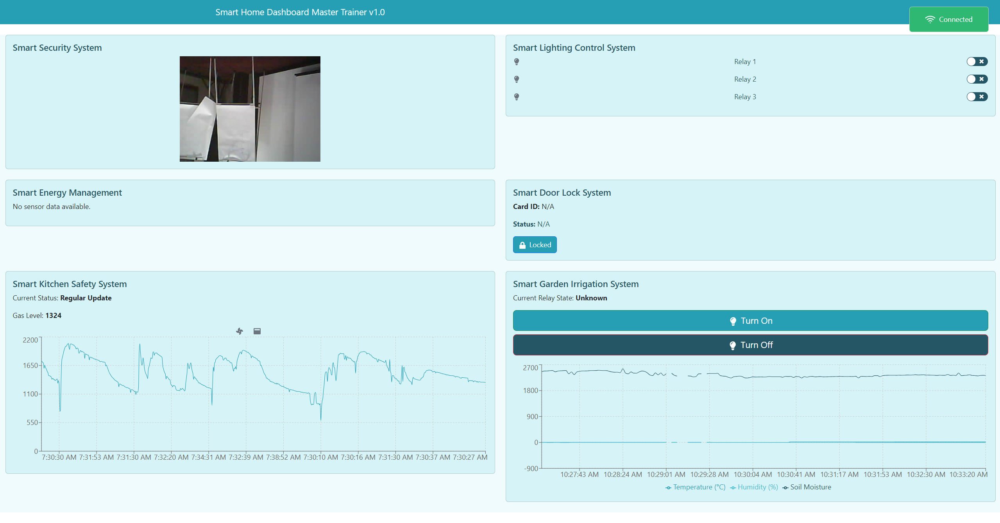

# 🏠 Smart Home Dashboard Master Trainer v1.0

Welcome to the **Smart Home Dashboard Master Trainer v1.0**! This project is a comprehensive React application that provides a unified dashboard to monitor and control various smart home devices using AWS IoT Core and MQTT protocol.



## 📋 Table of Contents

- [Features](#features)
- [Prerequisites](#prerequisites)
- [Installation](#installation)
- [Configuration](#configuration)
- [Usage](#usage)
- [Technologies Used](#technologies-used)
- [Contributing](#contributing)
- [License](#license)

## ✨ Features

- **Smart Security System** 📸: View live images from an ESP32-CAM.
- **Smart Lighting Control System** 💡: Control multiple relays to manage home lighting.
- **Smart Energy Management** 🌡️⚡: Monitor temperature, humidity, voltage, current, and power consumption.
- **Smart Door Lock System** 🔒: Check card information and lock status.
- **Smart Kitchen Safety System** 🍳🚨: Monitor gas levels and receive alerts.
- **Smart Garden Irrigation System** 🌱💧: Control garden irrigation and monitor soil moisture.

## ✅ Prerequisites

Before you begin, ensure you have met the following requirements:

- 📦 **Node.js** and **npm** installed.
- 🔐 An **AWS Account** with IoT Core and Cognito configured.
- 🛠️ **AWS SDK** credentials set up.
- 🌐 An **Internet Connection**.

## 📥 Installation

1. **Clone the repository**:

   ```bash
   git clone https://github.com/yourusername/smart-home-dashboard.git
   cd smart-home-dashboard
   ```

2. **Install dependencies**:

   ```bash
   npm install
   ```

## ⚙️ Configuration

Create an `aws-config.js` file in the `src` directory with the following content:

```javascript
// src/aws-config.js

export const AWS_REGION = "your-aws-region";
export const IDENTITY_POOL_ID = "your-identity-pool-id";
export const AWS_IOT_ENDPOINT = "your-aws-iot-endpoint";
```

- **`AWS_REGION`**: Your AWS region (e.g., `"us-east-1"`).
- **`IDENTITY_POOL_ID`**: Your Cognito Identity Pool ID.
- **`AWS_IOT_ENDPOINT`**: Your AWS IoT Core endpoint (without the protocol, e.g., `"a1b2c3d4e5f6g7.iot.us-east-1.amazonaws.com"`).

### 🔧 Setting Up AWS IoT Core

1. **Create an AWS Account**: If you don't have one, [sign up for AWS](https://aws.amazon.com/).

2. **Configure Cognito Identity Pool**:

   - Go to the [Cognito Console](https://console.aws.amazon.com/cognito/).
   - Create a new **Identity Pool** and enable access to unauthenticated identities.
   - Note down the **Identity Pool ID** (e.g., `us-east-1:xxxxxxxx-xxxx-xxxx-xxxx-xxxxxxxxxxxx`).

3. **Set Up AWS IoT Core**:

   - Navigate to the [AWS IoT Core Console](https://console.aws.amazon.com/iot/).
   - **Register a Device (Thing)** for each of your IoT devices.
   - **Create and attach an IoT Policy** that allows MQTT operations (`iot:Connect`, `iot:Subscribe`, `iot:Publish`, `iot:Receive`).
   - **Attach the Policy** to your Cognito Identity.

4. **Find Your AWS IoT Endpoint**:

   - In the AWS IoT Core Console, select **Settings**.
   - Copy the **Endpoint** address (exclude the `https://` part).

5. **Update `aws-config.js`** with your AWS credentials.

## 🏃‍♂️ Usage

Start the development server:

```bash
npm start
```

Open your browser and navigate to `http://localhost:3000` to view the dashboard.

## 🛠️ Technologies Used

- **React** ⚛️
- **AWS IoT Core** ☁️
- **AWS Cognito** 🔒
- **MQTT.js** 📡
- **Recharts** 📈
- **React Bootstrap** 💅
- **React Icons** 🎨

## 🤝 Contributing

Contributions are what make the open-source community such an amazing place to be learn, inspire, and create. Any contributions you make are **greatly appreciated**.

1. Fork the Project 🍴
2. Create your Feature Branch (`git checkout -b feature/AmazingFeature`) 🌟
3. Commit your Changes (`git commit -m 'Add some AmazingFeature'`) 💬
4. Push to the Branch (`git push origin feature/AmazingFeature`) 🚀
5. Open a Pull Request 📥

## 📄 License

Distributed under the MIT License. See `LICENSE` for more information.

---

Made with ❤️ by [Your Name](https://github.com/afandiazmi)

# 🌟 Project Overview

This dashboard integrates multiple smart home systems into a single interface, leveraging AWS services for secure and scalable communication.

## 📚 Detailed Features

### Smart Security System 📸

- **Description**: Displays images captured by an ESP32-CAM module.
- **Implementation**:
  - Subscribes to the MQTT topic `myespcam`.
  - Expects a payload containing a base64-encoded image.

### Smart Lighting Control System 💡

- **Description**: Allows users to control three relays to manage lighting.
- **Implementation**:
  - Subscribes to `smart/3lighting` and publishes to the same topic for control commands.
  - Uses switches to toggle relay states.

### Smart Energy Management 🌡️⚡

- **Description**: Monitors environmental and electrical parameters.
- **Implementation**:
  - Subscribes to `cloud/esp32`.
  - Displays data using `Recharts` for real-time visualization.

### Smart Door Lock System 🔒

- **Description**: Monitors door lock status and card information.
- **Implementation**:
  - Subscribes to `myesplock`.
  - Displays card ID, owner, status, and messages.

### Smart Kitchen Safety System 🍳🚨

- **Description**: Monitors gas levels and automates safety responses.
- **Implementation**:
  - Subscribes to `mykitchen/gas`.
  - Visual indicators for fan and window status.

### Smart Garden Irrigation System 🌱💧

- **Description**: Controls garden irrigation based on soil moisture.
- **Implementation**:
  - Subscribes to `smartgarden/data` for sensor data.
  - Publishes to `smartgarden/control` to control irrigation.

## 📝 Notes

- Ensure all your IoT devices are properly configured to publish and subscribe to the correct MQTT topics.
- Update the MQTT topics in the code if your devices use different ones.
- Monitor AWS IoT Core's **MQTT Test Client** to debug message flows.

## 🐛 Troubleshooting

- **Connection Issues**: Verify your AWS credentials and IoT policies.
- **Data Not Displaying**: Check if your devices are publishing data to the correct topics.
- **AWS Limits**: Be aware of AWS free tier limits to avoid unexpected charges.

## 📬 Contact

For any questions or suggestions, feel free to open an issue or contact me directly:

- **GitHub**: [afandiazmi](https://github.com/afandiazmi)

---

Enjoy building your smart home system! 🏡🚀
